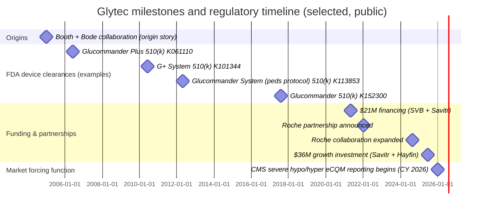
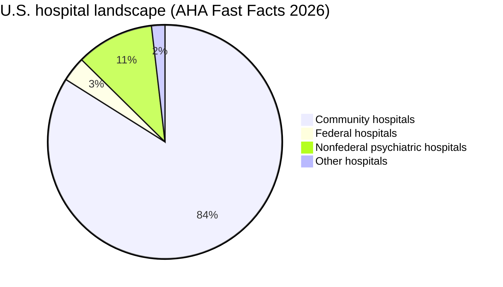

# Glytec Go-to-Market Deep Research and AI-Agent Enablement Brief

## Executive Summary

Glytec is a U.S.-focused diabetes and insulin management technology company built around **Glucommander®**, an **FDA-cleared, prescription-only insulin dosing decision-support software** integrated into hospital workflows, with a broader platform that now includes **analytics (Glytec Analytics / GlucoMetrics®)**, **services**, and an AI-positioned operations layer branded as the **Glytec Command Center**. citeturn5view0turn13view0turn29view0turn31search15

The company’s “why now” GTM tailwind is unusually clear: **CMS hospital eCQM reporting requirements for severe hypoglycemia and severe hyperglycemia begin in CY 2026**, creating a compliance-and-reputation forcing function that elevates inpatient glycemic management from “good practice” to **measured hospital harm outcomes**. CMS’ published measure logic defines severe hypoglycemia using **BG < 40 mg/dL** with additional timing/confirmation rules, and severe hyperglycemia using **BG > 300 mg/dL** day-based logic, among other criteria. citeturn17view0turn16search3

What appears to make Glytec “tick” (and what a 24/7 GTM AI agent should internalize) is the company’s consistent framing of inpatient glycemic care as a **patient safety + workflow reliability + financial throughput** problem: insulin is high-risk, hospitals are capacity constrained, and institutions need technology that moves beyond “paper protocols” toward **standardized, data-driven dosing** plus enterprise analytics for quality, ROI, and now CMS reporting readiness. This posture is visible across Glytec’s corporate narrative, product positioning, and recent customer announcements tied explicitly to CMS readiness and EHR integration. citeturn6view0turn35view0turn35view1turn35view3

Commercially, Glytec publicly reports **scale signals**: it states its platform is trusted by **400+ hospitals** (2025–2026 messaging), and earlier stated **300+ hospitals** (2021–2023 messaging), suggesting meaningful adoption and a large installed base for land-and-expand plays. citeturn12view1turn12view0turn34search23turn35view0

The competitive field is best understood as a category of **electronic glycemic management systems (eGMS)** / insulin dosing calculators—especially **Monarch Medical Technologies’ EndoTool** and **Medical Decision Network’s GlucoStabilizer**—plus “adjacent” competition from **EHR-native order sets/calculators** and homegrown protocols. These alternatives often share the same FDA device regulation number (868.1890) and product code (NDC) for drug-dose calculator-type devices, making differentiation depend heavily on workflow integration, breadth of indications, analytics/reporting, and implementation enablement rather than “FDA-cleared vs not.” citeturn2view0turn32search4turn32search5turn32search20turn32search6

Unknowns that require internal validation (and should be explicitly tracked as assumptions by an AI agent) include: exact **pricing and packaging**, current **module attach rates** (IV vs SubQ vs analytics/command center), true **market share** vs EndoTool and others, and the detailed **clinical/algorithmic “secret sauce” beyond what is publicly described** (since proprietary dosing logic is not fully disclosed in public materials). citeturn29view0turn12view1turn32search10

## Company overview and regulatory footprint

### Origin story, mission framing, and “category creation” posture

Glytec’s origin narrative emphasizes a 2005 collaboration between software developer **Robby Booth** and diabetologist **Dr. Bruce Bode**, culminating in what Glytec describes as the **first FDA-cleared software and algorithms for glucose management in 2006**. citeturn6view0turn1search4

This “category creator” posture is reinforced by regulatory history: the insulin dosing software line traces back to **Glucommander Plus (K061110; decision date 2006-06-07)** and subsequent clearances including **G+ System (K101344; 2010)** and **Glucommander System pediatric protocol (K113853; 2012)**, with **Glucommander (K152300; decision date 2017-08-04)** listed in FDA’s 510(k) database under the device classification **Calculator, Drug Dose**, regulation **21 CFR 868.1890**, product code **NDC**. citeturn1search2turn1search5turn21search27turn2view0

### Leadership and governance

Glytec’s current leadership page lists **Patrick F. Cua** as **President & CEO**, and includes a board with **Bruce W. Bode, MD**, **Patrick F. Cua**, **Deborah Dean**, and **Andrew R. Midler**. citeturn15view1turn14view0

### Funding and growth signals

Glytec announced **$21M in financing (April 26, 2021)**, described as **$9M debt from SVB** and **$12M equity led by Savitr Capital** (plus other private investors). citeturn12view0

In **June 2025**, Glytec announced a **$36M growth investment** led by **Savitr Capital** and **Hayfin Capital Management**, explicitly positioning the capital toward platform expansion, new technologies, and response to upcoming CMS glycemic reporting requirements. citeturn12view1

### Locations and scope

Glytec’s contact information lists a Boston address (100 Cambridge Street, 14th Floor, Boston, MA). citeturn11search1  
On the product/legal language across Glytec’s site, **Glucommander is stated as only available for use in the United States**. citeturn5view0turn29view0

### Product portfolio snapshot

Glytec’s current product suite (publicly) includes: **Glytec Command Center**, **Glucommander IV**, **Glucommander SubQ**, **Glytec Analytics**, and **Professional Services**. citeturn5view0turn13view0

Glytec positions the Command Center as an AI-powered “command and control” layer backed by **16+ years of experience** and data spanning **150M+ hospitalizations** (as claimed in product materials). citeturn5view0turn31search9

### Timeline of major milestones



Sources for the above include Glytec’s origin story, FDA 510(k) records, Glytec funding announcements, and Glytec’s Roche partnership announcements plus CMS eCQM timing referenced by Glytec and CMS materials. citeturn6view0turn1search2turn1search5turn21search27turn2view0turn12view0turn12view1turn18search4turn18search2turn17view0turn35view0

## Core technology, clinical evidence, and integrations

### What Glucommander is from a regulatory and clinical-workflow standpoint

Glytec describes Glucommander as a **dosage calculator** that compares glucose values to provider-selected targets, issues alerts, and provides dosing recommendations—but it is **not an active monitoring device**, and clinical decisions should not be based solely on software guidance. citeturn29view0

Indications and population coverage are consistently stated as **adult and pediatric ages 2–17** (not for pediatric patients under 2). citeturn29view0turn21search27

### Algorithmic approach and key functional capabilities

Peer-reviewed literature describes Glucommander as a **computer-directed IV insulin algorithm** that is flexible in timing and provides dosing in a graduated manner. citeturn21search0  
Glytec marketing/evidence documents further emphasize “personalization” using real-time and historical data and learning a patient’s insulin sensitivity (high-level descriptions rather than full algorithm disclosure). citeturn31search17turn32search17

Public Glytec materials describe several operational “guardrails” and workflow features, including: dynamic blood glucose check timing, alerts (e.g., glucose velocity warnings), and DKA-related decision support elements such as anion gap analysis and “Meter Max” behavior to manage glucose values above meter limits. citeturn32search17turn5view0turn29view0

### Integration and interoperability model

Glytec repeatedly positions itself as **EHR-integrated**, including specific Epic-facing positioning: Glytec appears in the **Epic vendor showroom** as “Medication Ordering Decision Support” for acute/inpatient care, and Glytec also publishes customer announcements citing Epic integration as a selection criterion. citeturn1search14turn35view1

A high-level integration loop described in Glytec materials includes: ADT patient context, lab results ingestion, order parameters, EHR flowsheet charting, and medication administration confirmation back to Glucommander. citeturn32search17turn35view0

Glytec also frames interoperability as enabling device data capture (e.g., glucometers and infusion pumps) and in-workflow decision support. citeturn18search28turn31search15

### Workflow view for an AI GTM agent to “understand the product”

```mermaid
flowchart TD
  A[Patient admitted / inpatient encounter starts] --> B[EHR context + ADT demographics]
  B --> C[Glucose inputs (POCT and/or lab BG)]
  C --> D[Glucommander dosing recommendation\nIV / SubQ dosing + timing guidance]
  D --> E[Clinician action in workflow\n(Order parameters + nurse administration)]
  E --> F[MAR documentation + confirmation loop]
  F --> G[Continuous surveillance + alerts\n(hypo/hyper excursions, guardrails)]
  G --> H[Analytics dashboards\nQuality, ROI, CMS eCQM readiness]
```

This workflow summarizes Glytec’s publicly described bidirectional EHR loop and analytics layer. citeturn32search17turn31search15turn34search22turn35view0

### Clinical evidence base

The public evidence base spans peer-reviewed articles, quality-improvement studies, and conference abstracts. The most load-bearing, widely citable elements include:

A foundational peer-reviewed study in *Diabetes Care* (2005) reported on Glucommander as a computer-directed IV insulin system and analyzed performance data. citeturn21search0

A prospective before–after cohort study (Canadian Journal of Hospital Pharmacy) compared Glucommander-managed insulin vs a paper nomogram in a cardiovascular surgery ICU (50 vs 50), reflecting early evidence of feasibility and comparative outcomes. citeturn21search18

A 2021 study in *Journal of Diabetes Science and Technology* evaluated Glucommander eGMS (IV + SQ) against previously utilized nomograms in a community hospital setting, explicitly focusing on efficacy and safety. citeturn24search14

Independent and semi-independent reviews summarize the broader “eGMS” category and describe major commercial systems (including Glucommander, EndoTool, and GlucoStabilizer), emphasizing that benefits often include reductions in hypo/hyperglycemia and variability, but that successful programs typically require training and institution-wide adoption. citeturn32search6turn32search29turn27search20

Glytec also publishes outcomes-oriented case materials (QI/case study format). For example, one Glytec case study reports improved basal-bolus insulin utilization, fewer hypo/hyperglycemic events, reduced LOS (7.18 to 5.51 days in the compared groups), and an annualized savings estimate ($7.49M in the example). These serve as GTM ROI narratives but should be treated as case-specific rather than universal performance guarantees. citeturn28view2

## Current ICP and expansion opportunities

### The current addressable hospital universe

Per the **American Hospital Association Fast Facts on U.S. Hospitals, 2026**, the U.S. has **6,100 total hospitals**, including **5,121 community hospitals**, and approximately **907,216 staffed beds** across all U.S. hospitals. citeturn20view0



(Counts sum to AHA’s 6,100 total hospitals.) citeturn20view0

### Glytec’s implied and explicit ICP

Glytec’s messaging consistently targets **hospitals and health systems** seeking safer, standardized insulin management that is integrated into the EHR and can generate analytics for quality and ROI. citeturn13view0turn35view0turn35view3

Based on Glytec’s own customer announcements and positioning, the strongest current ICP signals are:

Large multi-facility health systems with enterprise-scale implementations and expansions (e.g., Parkview Health renewals and expansion across facilities, including ED rollout). citeturn35view0

Academic health systems and complex-care environments where Epic integration, safety, and metrics enterprises matter (e.g., MUSC Health explicitly selected Glytec for Epic integration and CMS readiness). citeturn35view1

Systems preparing for CMS severe glycemic event eCQM reporting and seeking “turnkey” analytics/visibility into severe events and workflows. citeturn35view0turn17view0turn34search22

### Clinical and operational “hot zones” inside a hospital

From Glytec’s product descriptions and contraindications/warnings, the best-fit clinical settings include: ICU/critical care (IV insulin), general wards (SubQ basal-bolus), and complex metabolic crises support such as DKA/HHS in settings where IV insulin is required. citeturn5view0turn29view0turn31search17

### Future ICP and opportunity areas

Several future (or expanding) opportunity areas are explicitly signaled in Glytec communications:

Emergency department implementations and expansions (Parkview’s ED launch is positioned as part of the expansion). citeturn35view0

Device ecosystem partnerships (Roche + Glytec), aiming to combine bedside glucose testing with insulin decision support on a handheld device (cobas® pulse), and an expansion to broader geographies “where both solutions are available.” citeturn18search8turn18search2

Movement toward CGM use in inpatient settings is presented as part of Glytec’s product vision. citeturn13view0turn27search20

Health plan / payer and “hospital-to-home” continuity plays are implied in “continuum of care” language and by an executive role focused on health plans & systems, but details and commercial packaging here are not fully public. citeturn15view0turn12view0

## Buyer personas, procurement, pricing and reimbursement signals

### Buying committee and personas that repeatedly show up in Glytec narratives

In customer announcements, Glytec emphasizes collaboration with clinical leadership, quality stakeholders, and IT/EHR teams—suggesting a buying committee that typically spans:

Clinical leadership (CMO, Chief Quality Officer, hospitalists/endocrine leadership), since the value proposition is patient safety/outcomes and standard-of-care alignment. citeturn35view1turn16search2turn27search20

Nursing leadership (CNO, ICU leaders, nurse educators) because insulin titration is workflow-intensive and adoption is behavior change; Glytec publishes nurse-oriented implementation materials. citeturn28view1turn28view0

Pharmacy leadership (Director of Pharmacy, medication safety officers) given insulin risk and medication safety framing; Glytec explicitly markets to clinician/pharmacist workflow improvements. citeturn34search18turn34search23

IT/EHR leadership (CIO, CMIO, Epic analysts) because EHR integration is central and cited as a selection criterion (e.g., MUSC chose Glytec for Epic integration). citeturn35view1turn1search14

Finance/value leadership (CFO, VP Value-Based Care, supply chain/procurement) as Glytec foregrounds LOS, readmissions, ROI, and CMS readiness analytics. citeturn35view0turn35view3turn28view2

### Pricing and procurement signals (what can be inferred publicly)

Glytec positions itself as a **cloud-based SaaS platform** for hospitals. citeturn12view1turn13view0turn35view3

While exact pricing is not publicly listed, Glytec’s own ROI framing strongly suggests common enterprise health IT procurement patterns: platform licensing + implementation services + ongoing support/optimization. Evidence for “per-bed” ROI framing appears in the 2021 financing announcement, which cites “annualized cost savings as high as **$20,000 per licensed bed**” and “enterprise-wide utilization… at or above **95% of eligible patients**” as reported by customers. citeturn12view0

### Reimbursement and ROI storyline

Glytec’s most consistent ROI narrative is that improved glycemic management reduces high-cost harm events, which then improves throughput and costs via:

Lower severe hypoglycemia rates (Glytec repeatedly cites up to **99.8% reduction** as a headline claim in multiple public announcements). citeturn35view0turn35view3turn13view0

Shorter length of stay (including ICU LOS narratives). citeturn35view3turn28view2turn5view0

Fewer readmissions (Glytec cites 35–68% reduction in a market leadership announcement and broader reductions in other materials; treat as context-dependent). citeturn35view3turn13view0

Direct operational savings via fewer point-of-care tests and fewer hypoglycemia events (case study example calculates savings per hypoglycemic event). citeturn28view2

The key GTM nuance for an AI agent: ROI claims are **case-study and cohort dependent**; the most defensible approach in selling is to tie ROI to (a) baseline event rates, (b) CMS HH-Hypo/HH-Hyper measure definitions, and (c) measurable workflow adoption (percent of eligible patients, compliance to protocol). citeturn17view0turn12view0turn35view0turn28view0

## GTM motions, channels and partnerships

### Dominant GTM motion

Glytec’s public motion appears heavily **enterprise B2B direct to hospitals/health systems**, emphasizing:

EHR integration and workflow embeddedness, supported by Epic marketplace-type exposure. citeturn1search14turn35view1

Executive-ready analytics and CMS reporting readiness, increasingly central since CMS eCQM reporting begins in 2026. citeturn35view0turn34search22turn17view0

Implementation enablement and long-term partnership language (implementation support materials frame Glytec as a “partner for long-term success”). citeturn28view0turn13view0

### Partnerships and ecosystem channels

Roche partnership: Glytec and Roche announced a strategic partnership intended to combine bedside glucose testing with Glytec insulin decision support on Roche’s cobas® pulse smart device, and later expanded collaboration for broader markets. citeturn18search8turn18search2

Regulatory/quality advocacy positioning: Glytec explicitly ties marketing to CMS mandates and publishes educational material about new CMS eCQM requirements. citeturn16search3turn35view3turn34search10

Third-party validation channel: Glytec promoted a **KLAS First Look** report and cited customer-reported benefits and repurchase intent (e.g., 93% “would buy again,” per their PR summary). This is a meaningful trust asset in enterprise healthcare procurement, even though full KLAS data is gated. citeturn32search14turn34search13turn32search10

## Competitive landscape, objections, adoption risks, and GTM AI-agent KPI framework

### Competitive landscape

The most direct competitive set in inpatient insulin dosing decision support/eGMS includes:

Monarch Medical Technologies EndoTool (IV and SubQ). FDA review documents describe EndoTool SubQ (K211160) and EndoTool IV (K201619) as software applications that evaluate glucose values and recommend insulin/dextrose/carbohydrate dosing toward a provider-ordered target range, including pediatric coverage for certain versions. citeturn32search4turn32search30

Medical Decision Network GlucoStabilizer (K141321). FDA documentation describes it as a web-based software solution automating IV insulin drip rate calculations with alerts for subsequent glucose testing/monitoring. citeturn32search5turn32search20turn32search1

EHR-native protocols/calculators and local paper protocols (adjacent “do nothing / do it ourselves” competition), often justified on cost, control, and clinician preference; industry guidance and reviews note that implementation and institution-wide adoption are significant determinants of success for any eGMS approach. citeturn32search6turn27search20turn28view0

### Common objections and high-quality rebuttal themes

Objection: “We already have insulin protocols / order sets.”  
Rebuttal: CMS HH-Hypo and HH-Hyper eCQMs formalize severe glycemic events as hospital harm outcomes, requiring reliable data capture and measure-aligned workflows; Glytec positions its analytics and reporting as enabling readiness and continuous improvement on these exact outcomes. citeturn17view0turn35view0turn34search22

Objection: “Integration will be painful and IT won’t prioritize it.”  
Rebuttal: Glytec sells into Epic environments and emphasizes embedded workflow and EHR integration; Epic marketplace presence and customer selection statements (MUSC) are proof points for feasibility. citeturn1search14turn35view1turn32search17

Objection: “Clinicians won’t trust the algorithm; liability risk.”  
Rebuttal: Glucommander is FDA-cleared and explicitly framed as clinical decision support, not an autonomous monitoring device; Glytec’s contraindications/warnings emphasize clinician judgment and training. That message aligns with FDA’s broader framing that CDS oversight depends on intended use and appropriate transparency and labeling. citeturn29view0turn36search0turn36search8

Objection: “The ROI isn’t real / we can’t prove savings.”  
Rebuttal: Anchor ROI to measurable outcomes relevant to CMS and hospital finance: severe events (per CMS definitions), LOS, readmissions, and testing burden; Glytec offers case-based ROI narratives and analytics dashboards designed to quantify avoided events, costs, and CMS readiness metrics. (A disciplined sale should propose a baseline assessment and measurement plan rather than relying on generic ROI claims.) citeturn28view2turn35view0turn35view3turn34search22

### Implementation and clinical adoption challenges

Public materials and industry reviews converge on the same adoption reality: successful glycemic management platforms require training, standardized order sets, and coordinated multi-disciplinary change management; these are not “install-and-forget” tools. citeturn28view0turn32search6turn27search20

Glytec-specific adoption risks are also explicit in its own safety labeling: contraindications include terminal patients (<48-hour life expectancy), extreme insulin resistance warnings (e.g., >500 units/hr), insulin allergy, and pediatrics under 2; warnings highlight that nutrition, stress, and medications (e.g., steroids) can rapidly change insulin needs and must be clinically considered. citeturn29view0turn21search4

### Legal, regulatory, and ethical considerations for a GTM AI agent

FDA regulatory posture: Glucommander is an FDA-cleared device in the drug-dose calculator class, and the broader CDS environment is governed by FDA guidance defining how CDS software may fall under FDA oversight. citeturn2view0turn36search0turn36search12

Cybersecurity: As a cloud-based, EHR-integrated medical software platform, Glytec deployments live inside hospital threat models; FDA’s premarket cybersecurity guidance emphasizes secure design, labeling, and documentation expectations for devices with cybersecurity risk. citeturn36search2turn36search6

HIPAA / security compliance: Hospital deployments necessarily involve ePHI; HHS’s HIPAA Security Rule summary highlights required administrative, physical, and technical safeguards to protect ePHI. citeturn36search1

Ethical/operational AI risks: Glytec markets AI and generative AI guidance in the Command Center; the AI agent should track and flag potential “automation bias” risks and ensure messaging remains consistent with labeling that Glucommander support does not replace clinician judgment. citeturn5view0turn29view0turn36search0

### KPI framework for a 24/7 GTM AI agent

A practical KPI system should monitor four layers: market triggers, pipeline/commercial, implementation/customer health, and outcomes/quality evidence.

Market and compliance triggers to monitor continuously include CMS HH-Hypo/HH-Hyper updates and yearly eCQM spec changes, given that CMS publishes annual measure tables and updates, and CY 2026 is already in effect for mandatory reporting. citeturn17view0turn16search9

Commercial KPIs should include: signal of “CMS readiness urgency” in inbound/outbound conversations, Epic install base alignment, opportunity stage conversion, and multi-site expansion probability (Glytec’s own wins emphasize renewals + expansions + ED rollouts). citeturn35view0turn35view3turn1search14

Implementation/customer health KPIs should include: percent of eligible patients treated (Glytec cited customer utilization at/above 95% in 2021), time-to-go-live and milestone adherence (implementation materials emphasize structured support), and post-go-live optimization cadence. citeturn12view0turn28view0

Outcomes KPIs should include: CMS-aligned severe event rates, time-to-target, time-in-range, LOS, readmissions, and testing volume—because these are exactly the metrics Glytec and its customers reference in case studies and CMS readiness messaging. citeturn17view0turn35view0turn28view2turn35view3

## Appendices: Comparative tables and target-account shortlist

### Product comparison table

| Product/module | Primary users | Core job-to-be-done | Differentiation signals (public) | Regulatory posture (public) |
|---|---|---|---|---|
| Glucommander IV | ICU nurses, intensivists, pharmacists | Standardize IV insulin titration; manage complex conditions (e.g., DKA/HHS) | FDA-cleared; replaces complex IV protocols; safety guardrails; EHR/workflow integration | Prescription-only software medical device; drug-dose calculator class; part of Glytec’s FDA-cleared portfolio citeturn5view0turn2view0turn29view0 |
| Glucommander SubQ | Floor nurses, hospitalists, endocrine teams | Scale basal-bolus SubQ insulin; transition from IV; discharge support | Seamless IV→SubQ transition; daily adjustments; discharge recommendations | Indicated for adults and pediatric ages 2–17; not for <2 years citeturn5view0turn29view0turn21search27 |
| Glytec Analytics / GlucoMetrics | Quality leaders, executives, glycemic committees | Monitor performance; benchmark; report CMS readiness | Dashboards + reporting positioned for CMS measure readiness and ROI | Analytics layer within platform positioning citeturn5view0turn31search15turn34search22 |
| Glytec Command Center | Executives, quality, clinical ops | “Command and control” visibility + AI decision support | AI-powered “executive-ready insights,” risk identification/prediction; data claims of 150M+ hospitalizations | Not separately described as a cleared device in public snippets; marketed as platform layer—validate internally citeturn5view0turn31search9 |
| Professional Services | Clinical transformation leaders | Implementation support + adoption acceleration | “Blueprint for Success,” training, optimization framing | Service wrapper around FDA-cleared tool use citeturn5view0turn28view0turn29view0 |

### Competitor comparison table

| Category | Glytec (Glucommander/eGMS) | Monarch Medical Technologies (EndoTool) | Medical Decision Network (GlucoStabilizer) | EHR-native protocols / paper |
|---|---|---|---|---|
| FDA status | Multiple 510(k)s under 868.1890 / NDC; Glucommander K152300 listed; earlier lineage includes K061110, K101344, K113853 citeturn2view0turn1search2turn1search5turn21search27 | EndoTool SubQ and IV have FDA reviews (e.g., K211160, K201619) under similar drug-dose calculator paradigm citeturn32search4turn32search30 | GlucoStabilizer K141321 FDA-cleared for hospitalized patients; web-based software automating IV insulin dosing calculations citeturn32search5turn32search20 | Varies; not a “product device” unless commercial CDS; site-specific protocols |
| Core thesis | EHR-integrated dosing + analytics + platform, tied to CMS readiness | Patient-specific dosing system; competitor claims often emphasize patient-specific control tech | IV insulin dosing calculator focus + alerts | Lowest cost; highest variability; harder to measure/report |
| Platform/analytics emphasis | Strong enterprise analytics & CMS reporting readiness messaging | Analytics varies by vendor; widely marketed outcomes/case studies | More IV-focused positioning historically | Typically limited enterprise analytics unless built internally |
| Key GTM differentiator | “First-ever FDA-cleared cloud-based insulin management software,” broad adoption claims (400+ hospitals) citeturn12view1turn35view0 | Strong IV/SubQ footprint; 20+ years positioning | Established IV calculator niche | Control and familiarity; but compliance and harm-measure pressure rising citeturn17view0turn32search3turn32search16 |

### Customer segment table

| Segment | Why it fits Glytec | Primary entry wedge | Expansion wedge |
|---|---|---|---|
| Large multi-hospital systems | Enterprise standardization + dashboards + CMS reporting readiness across sites citeturn35view0turn35view3 | High-acuity IV insulin + safety narrative | Rollout to SubQ, ED, and analytics/command center citeturn35view0turn31search15 |
| Academic medical centers | Complex patients; strong QI culture; Epic integration emphasis citeturn35view1turn1search14 | ICU/stepdown IV insulin; DKA workflows | Research + systemwide metrics; interoperability projects citeturn18search28turn34search22 |
| Community hospitals | Need standardized protocols; limited endocrine coverage; CMS reporting burden citeturn12view0turn17view0 | Rapid “replace paper protocol” story | Analytics + benchmarking across units |
| ED-heavy institutions | Severe event avoidance + early glycemic stabilization matters; ED rollouts now visible in wins citeturn35view0 | ED pilot | Enterprise expansion |
| Systems focused on device ecosystems | Roche-cobas pulse integration opportunity | Point-of-care workflow transformation | Device+software ecosystem spread across facilities citeturn18search8turn18search2 |

### Prioritized target-account shortlist with rationale

**Important**: The list below mixes (a) **publicly confirmed Glytec customers/partners** and (b) **high-fit prospects**. For prospects, this report does **not** assert current vendor status; it proposes targets based on public ICP signals (scale, CMS readiness pressure, Epic integration patterns, and multi-site standardization needs). Validate in CRM and internal sales intelligence before outbound.

| Priority tier | Account | Type | Rationale grounded in public signals |
|---|---|---|---|
| Expand | Parkview Health | Public customer expansion | Multi-facility renewal and expansion (10 facilities + ED + new hospitals) explicitly tied to CMS HH-Hypo/HH-Hyper reporting readiness and EHR integration; ideal for upsell of analytics/enterprise layers citeturn35view0 |
| Expand | MUSC Health | New partnership | Selected for Epic integration; explicitly positioned for CMS reporting readiness across clinical settings; strong academic visibility citeturn35view1 |
| Expand | TidalHealth | New partnership | Partnership framed as improving outcomes and expanding to additional chronic conditions over time; ROI language suggests value narrative fit citeturn35view2 |
| Expand | AdventHealth | Publicly cited customer | Named among systems that “trust Glytec” in financing announcement; likely enterprise expansion potential (validate current footprint) citeturn12view0 |
| Expand | Novant Health | Publicly cited customer | Same as above; potential analytics/CMS readiness expansion citeturn12view0 |
| Expand | Sentara Healthcare | Publicly cited customer | Same as above; CMS reporting readiness likely enterprise driver citeturn12view0 |
| Acquire | Large U.S. multi-hospital systems (illustrative): HCA Healthcare, CommonSpirit, Trinity Health, Ascension | Prospect archetype | AHA shows 3,567 community hospitals are in systems; large systems face outsized governance, reporting, and standardization burden—aligning with Glytec’s enterprise messaging (validate each system’s vendor status) citeturn20view0turn35view0turn35view3 |
| Acquire | Academic “destination” systems (illustrative): Mayo Clinic, Cleveland Clinic, UPMC | Prospect archetype | High acuity + strong QI + enterprise reporting needs; aligns with Epic integration and safety/outcomes narrative (validate vendor status) citeturn1search14turn17view0turn35view1 |
| Acquire | Regional systems in high-diabetes burden geographies (state-level targeting) | Prospect strategy | CDC reports diabetes prevalence remains high nationally; CMS harm measures create universal pressure—state-by-state targeting should align outbound with highest diabetes burden + hospital system density (requires internal geo analytics) citeturn19search2turn19search6turn17view0 |

### Key assumptions to track explicitly

Assumption that “Command Center” is packaged and sold as an attachable enterprise module across the installed base (public messaging supports the concept, but packaging details are not public). citeturn5view0turn31search9

Assumption that CMS HH-Hypo/HH-Hyper reporting pain directly increases buying urgency; this is strongly implied by Glytec’s customer announcements and CMS mandatory measure status for 2026, but individual hospitals’ readiness varies. citeturn35view0turn17view0turn16search8

Assumption that EHR integration depth and analytics readiness are primary differentiators; public sources strongly support integration/analytics emphasis, but comparative proof vs each competitor requires deeper (often paid) benchmarking data. citeturn1search14turn34search22turn32search10turn32search6